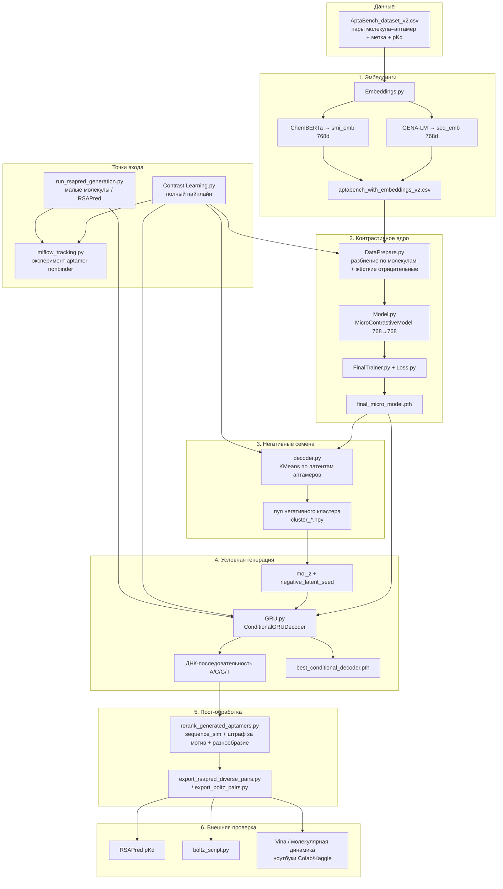

# Contrast Learning — генерация несвязывающихся аптамеров

Пайплайн для генерации ДНК/РНК-последовательностей аптамеров, которые **не должны** связываться с заданной малой молекулой. Основан на контрастивном обучении (768→768), кластеризации негативных латентных точек, условном GRU-декодере и постфильтрации (переранжирование + штраф за мотив).

**Статус проверки (июнь 2026):** на 19 разнообразных парах (RSAPred, в домене, `motif=0`) — **13/19 (68%)** проходят порог RSAPred (pKd < 4.5). Лучший кандидат **mol7_diverse_1** подтверждён тремя метриками (RSAPred + Boltz + Vina). Сводка: `validation_summary.csv`, `rsapred_validation_results.csv`.

## Учёт экспериментов (MLflow)

Основной `Contrast Learning.py` пишет один прогон на полный цикл
`контрастив → GRU → генерация` в `Contrast Learning/mlflow.db`
(путь зафиксирован к папке проекта, не зависит от текущей директории).

Если при старте нет строки `MLflow run: ...`, учёт **не включился**
(обычно пакет `mlflow` не установлен в том же Python, что запускает скрипт).

```bash
# в том же окружении, где крутится пайплайн:
pip install mlflow
python -c "import mlflow; print(mlflow.__version__)"

cd "C:\Users\USER\Contrast Learning"
python check_mlflow.py
python "Contrast Learning.py"

# интерфейс — абсолютный путь, пробелы оставлять как есть (НЕ %20):
mlflow ui --backend-store-uri "sqlite:///C:/Users/USER/Contrast Learning/mlflow.db"
```

В логе старта ищите эксперимент `aptamer-nonbinder` (не Default).
Интерфейс: `http://127.0.0.1:5000`.

- `MLFLOW_ENABLED=0` — отключить учёт;
- `MLFLOW_TRACKING_URI=...` — другое хранилище / удалённый сервер.

---


## Архитектура пайплайна




**Кратко по слоям**


| Слой             | Файлы                                                      | Роль                                                    |
| ---------------- | ---------------------------------------------------------- | ------------------------------------------------------- |
| Данные           | `AptaBench_*.csv`                                          | пары SMILES–последовательность, метка, pKd              |
| Эмбеддинги       | `Embeddings.py`                                            | GENA-LM + ChemBERTa → 768d                              |
| Контрастив       | `Model.py`, `FinalTrainer.py`, `Loss.py`, `DataPrepare.py` | разделение binder / non-binder в латентном пространстве |
| Семена           | `decoder.py`                                               | KMeans → негативные латентные точки                     |
| Генерация        | `GRU.py`                                                   | `mol_z` + негативное семя → ДНК                         |
| Оркестрация      | `Contrast Learning.py`, `run_rsapred_generation.py`        | полный / RSAPred-прогон                                 |
| Учёт             | `mlflow_tracking.py`                                       | один прогон на пайплайн                                 |
| Переранжирование | `rerank_generated_aptamers.py`                             | фильтр + разнообразие                                   |
| Проверка         | RSAPred, Boltz, Vina / МД                                  | триангуляция сродства                                   |


**Главная идея:** контрастивная модель учит, что binder близок к молекуле в 768d, а non-binder — далёк. GRU генерирует последовательности из **негативных** семян, чтобы аптамер был «далёким» от молекулы. Дальше — переранжирование и внешняя проверка (RSAPred / Boltz / Vina).

**Важно:** обычный прогон (`Contrast Learning.py`) даёт крупные аминогликозиды — **вне домена RSAPred**. Для проверки сродства к связыванию используйте `run_rsapred_generation.py`.

---


## Структура проекта


### Основные скрипты


| Файл                                       | Назначение                                                                    |
| ------------------------------------------ | ----------------------------------------------------------------------------- |
| `Contrast Learning.py`                     | Полный пайплайн: контрастив → кластеры → GRU → генерация (тестовое разбиение) |
| `run_rsapred_generation.py`                | Генерация для малых RSAPred-мишеней с pKd (до 20 молекул)                     |
| `Embeddings.py`                            | `seq_emb_*` / `smi_emb_*` из последовательности + SMILES                      |
| `DataPrepare.py`                           | датасет, разбиение по молекулам, жёсткие отрицательные примеры                |
| `Model.py` / `FinalTrainer.py` / `Loss.py` | контрастивная модель и обучение                                               |
| `decoder.py`                               | KMeans → семена негативного кластера                                          |
| `GRU.py`                                   | условный декодер, генерация, штраф за мотив, отбор по разнообразию            |
| `rerank_generated_aptamers.py`             | постфильтрация: `sequence_sim`, `rank_diverse`                                |
| `export_rsapred_diverse_pairs.py`          | экспорт разнообразных пар (`motif=0`) для RSAPred                             |
| `export_boltz_pairs.py`                    | экспорт пар для Boltz из CSV переранжирования                                 |
| `boltz_script.py`                          | пакетный Boltz-2 (`aptabench` / `--from-selected-pairs`)                      |
| `diagnose_contrastive_training.py`         | диагностика разделимости после обучения                                       |
| `preview_rsapred_targets.py`               | просмотр мишеней RSAPred-прогона                                              |
| `mlflow_tracking.py`                       | учёт экспериментов                                                            |
| `colab_md_runner.py` / `vina_md_screen.py` | докинг и короткая МД (Colab/Kaggle)                                           |


### Артефакты


| Файл                                  | Описание                                    |
| ------------------------------------- | ------------------------------------------- |
| `final_micro_model.pth`               | веса контрастивной модели                   |
| `best_conditional_decoder.pth`        | веса GRU                                    |
| `cluster_*.npy`                       | кластеры KMeans негативных семян            |
| `generation_summary.csv`              | обычная генерация                           |
| `rsapred_generation_summary.csv`      | RSAPred-генерация (20 молекул)              |
| `rsapred_rerank_all.csv`              | переранжирование RSAPred-пар                |
| `rsapred_validation_results.csv`      | RSAPred pKd, 19 разнообразных пар           |
| `rsapred_pairs_to_submit.csv`         | 19 пар для ручной проверки                  |
| `rsapred_selenium_batch.py`           | пакетная отправка пар в RSAPred             |
| `requirements-rsapred-automation.txt` | зависимости для `rsapred_selenium_batch.py` |
| `boltz_rsapred_top10_pairs.csv`       | топ-10 для Boltz                            |
| `validation_summary.csv`              | RSAPred + Boltz + Vina (сводная)            |


Доп. документация: `GRU_ARCHITECTURE_AND_PIPELINE.md`, `PIPELINE_HANDOFF.md`, `VALIDATION_PAIRS_CAFFEINE.md`.

---


## Установка


### Conda (генерация + contrastive)

```bash
cd "Contrast Learning"
conda env create -f environment.yaml
conda activate contrast-learning
# или: conda activate new_chemberta_env
```


### Boltz-2 (отдельное окружение)

```bash
conda activate boltz
# CLI: boltz predict ...
```


### HuggingFace (при первом запуске)

- Аптамеры: `AIRI-Institute/gena-lm-bert-base`
- Молекулы: `seyonec/ChemBERTa-zinc-base-v1`

---


## Быстрый старт


### 1. Эмбеддинги

```bash
python Embeddings.py
```


### 2a. Генерация (default — test split)

```bash
python "Contrast Learning.py"
```

Выход: `generation_summary.csv`, `top_candidates_for_tools.csv`, `generated_pairs_molecule_aptamer.txt`.

### 2b. Генерация для RSAPred (рекомендуется для валидации)

```bash
python run_rsapred_generation.py --max-targets 20 --max-heavy-atoms 40
```

Выход: `rsapred_target_molecules.csv`, `rsapred_generation_summary.csv`, `rsapred_top_candidates_for_tools.csv`.

Приоритетные мишени: caffeine, xanthine, 2-aminopyrimidine.

### 3. Переранжирование

```bash
# RSAPred-прогон
python rerank_generated_aptamers.py ^
  --use-summary ^
  --summary rsapred_generation_summary.csv ^
  --all-molecules ^
  --output rsapred_rerank_all.csv ^
  --max-motif-penalty 0.05

# Default-прогон
python rerank_generated_aptamers.py ^
  --use-summary ^
  --summary generation_summary.csv ^
  --all-molecules ^
  --output rerank_all.csv ^
  --max-motif-penalty 0.05
```

Экспорт diverse-пар без шаблонов:

```bash
python export_rsapred_diverse_pairs.py
```


### 4. RSAPred (автоматизация или вручную)

**Автоматически** — Microsoft Edge (Selenium Manager) или HTTP без браузера:

```bash
pip install -r requirements-rsapred-automation.txt

# Edge с окном (по умолчанию; стабильно на RSAPred)
python rsapred_selenium_batch.py --input rsapred_pairs_to_submit.csv

# Headless (может не загрузить форму)
python rsapred_selenium_batch.py --headless

# Явный путь к msedgedriver (если версия совпадает с Edge)
python rsapred_selenium_batch.py --driver C:\path\to\msedgedriver.exe

# HTTP POST (тот же формуляр, без браузера)
python rsapred_selenium_batch.py --backend requests --input rsapred_pairs_to_submit.csv
```

Результаты: `rsapred_automation_results.csv` (resume при повторном запуске).  
Порог: **pKd < 4.5** → negative-like (`rsapred_pass=True`).

**Вручную** на сайте — те же пары из `rsapred_pairs_to_submit.csv` (колонки `rna_sequence`, `smiles`).

### 5. Boltz-2

```bash
conda activate boltz
python boltz_script.py aptabench ^
  --from-selected-pairs boltz_rsapred_top10_pairs.csv ^
  --timeout 3600
```

Dry-run (только YAML-конфиги):

```bash
python boltz_script.py aptabench --from-selected-pairs boltz_rsapred_top10_pairs.csv --dry-run
```

Калибровка на AptaBench:

```bash
python boltz_script.py aptabench --data aptabench_with_embeddings_v2.csv --n-positive 100 --n-negative 100
```


### 6. Vina / SimRNA (Colab)

См. `докинг_fixed.ipynb`. Coarse-grained RNA (~95 атомов) — **вспомогательная** метрика.

---


## Настройки (`Contrast Learning.py`)

```python
DATA_FILE = "aptabench_with_embeddings_v2.csv"
MODEL_CHECKPOINT = "final_micro_model.pth"
USE_PRETRAINED = False   # True = загрузить готовые веса без retrain
```


### GEN_CONFIG


| Параметр                      | Значение | Смысл                                     |
| ----------------------------- | -------- | ----------------------------------------- |
| `target_smiles`               | `None`   | Подстрока SMILES или test split           |
| `max_generation_targets`      | `10`     | Top-N по `contrastive_separation`         |
| `min_contrastive_separation`  | `0.05`   | Мин. зазор pos/neg для мишени             |
| `max_latent_sim_for_decode`   | `-0.10`  | Порог cosine(mol_z, decoded_seq)          |
| `sequence_sim_filter`         | `True`   | `decoded_sim < positive_mean`             |
| `motif_penalty_weight`        | `0.15`   | Штраф за шаблоны CTTACGAC / GGGACGAC      |
| `max_motif_penalty_for_tools` | `0.05`   | Макс. штраф за мотив в top-K для tools    |
| `reject_high_motif_repeat`    | `True`   | Отсекать сильные повторы мотива           |
| `max_same_prefix`             | `2`      | Лимит одинаковых префиксов (разнообразие) |
| `n_keep`                      | `50`     | Аптамеров на молекулу                     |


Пример одной мишени (caffeine):

```python
"target_smiles": "Cn1c(=O)c2[nH]cnc2n(C)c1=O",
```

---


## Интерпретация метрик


### Генерация (`generation_summary.csv`)


| Метрика                  | Хорошо   | Плохо    | Смысл                                                  |
| ------------------------ | -------- | -------- | ------------------------------------------------------ |
| `seed_sim`               | < 0      | > 0.15   | Cosine(mol_z, negative seed)                           |
| `decoded_sim`            | < −0.15  | > 0      | Cosine(mol_z, aptamer после GRU)                       |
| `motif_penalty`          | **0.00** | **0.12** | Шаблоны CTTACGAC / GGGACGAC (штрафуются при генерации) |
| `contrastive_separation` | ≥ 0.05   | < 0.05   | Зазор pos/neg mean                                     |


В генерации уже включены штраф за мотив, отсечение повторов (`reject_high_motif_repeat`) и отбор по разнообразию (`select_diverse_output_candidates` / `max_same_prefix`). Типичный RSAPred-прогон: mean `decoded_sim` ≈ **−0.18**; в топе для tools обычно `motif_penalty ≤ 0.05`.

> **Устарело:** `sequence_sim` 0.83–0.96 — для **сырых** эмбеддингов без контрастива. Сейчас значения **отрицательные**.


### Rerank (`rerank_*.csv`)


| Метрика                  | Фильтр                                           |
| ------------------------ | ------------------------------------------------ |
| `sequence_sim`           | ≤ 0.15 (absolute)                                |
| `passes_relative_filter` | < `baseline_positive_mean`                       |
| `motif_penalty`          | ≤ 0.05 для diverse                               |
| `rank_diverse`           | 1 = лучший без шаблона                           |
| `composite_score`        | `sequence_sim + 0.15 × motif_penalty`, min лучше |


### RSAPred pKd


| Класс    | mean pKd |
| -------- | -------- |
| positive | ~6.24    |
| negative | ~3.34    |


**Порог:** pKd **< 4.5** → negative-like (mM).

### Boltz `affinity_pred_value`

log₁₀(IC50, µM). **Выше = слабее связывание.**

- Ensemble **> +2** → слабое (эвристика из caffeine-калибровки)
- Скрипт также берёт **best run** (подмодель с max `affinity_probability_binary`)
- На AptaBench pos/neg ensemble **плохо разделяются** (~−1.5 vs −1.9) — смотрите оба значения


### Vina (kcal/mol)

**Более отрицательное = сильнее связывание** (знак противоположен Boltz).


| Класс             | типично |
| ----------------- | ------- |
| RSAPred positives | ~−8.5   |
| RSAPred negatives | ~−5.6   |


Цель для non-binding: **−5 … −6**, не ниже **−7**.

### Decision tree (триангуляция)

```text
decoded_sim < positive_mean?  → contrastive PASS
    ↓
RSAPred pKd < 4.5?            → external negative-like
    ↓
Boltz best > −3?              → good_negative (скрипт)
Boltz ensemble > +2?          → weak (доп. эвристика)
    ↓
Vina ≈ −5.5 … −6?             → согласуется с RSAPred negatives
```

**Gold candidate:** ≥2 из 3 внешних валидаторов в negative-зоне.

---


## Результаты валидации


### RSAPred — 19 diverse-пар (`rsapred_validation_results.csv`)


| Метрика          | Значение                              |
| ---------------- | ------------------------------------- |
| PASS (pKd < 4.5) | **13 / 19 (68%)**                     |
| Лучший           | mol7_diverse_3 → **pKd 2.8**          |
| Худший           | mol10_diverse_1 → **pKd 6.37** (µM)   |
| Лучшая мишень    | mol7 (`Nc1ncc2[nH]cnc2n1`) — 3/3 PASS |
| Слабые мишени    | mol4, mol10 — 0% PASS                 |


### Boltz — top-10 (5/10 завершено, `run_20260615_022557`)


| pair_id        | RSAPred | ensemble  | best run |
| -------------- | ------- | --------- | -------- |
| mol7_diverse_3 | 2.8     | −0.27     | −2.09    |
| mol7_diverse_1 | 3.1     | +0.26     | −1.85    |
| mol7_diverse_2 | 3.13    | −0.26     | −2.15    |
| mol1_diverse_1 | 3.55    | −1.62     | −2.09    |
| mol9_diverse_2 | 3.74    | **+2.67** | −2.26    |


Best run (~−2.0) близок к AptaBench negatives (mean −1.7). Ensemble нестабилен (1/5 > +2).

### Vina — 5 пар (Colab)


| pair_id         | RSAPred | Vina best | PASS (−5…−6) |
| --------------- | ------- | --------- | ------------ |
| mol7_diverse_1  | 3.1     | **−5.58** | ✓            |
| mol7_diverse_2  | 3.13    | −5.86     | ✓            |
| mol1_diverse_1  | 3.55    | −5.83     | ✓            |
| mol18_diverse_1 | 3.76    | −5.78     | ✓            |
| mol9_diverse_2  | 3.74    | −6.65     | ⚠ (сильнее)  |


### Gold candidate (полная триангуляция)

**mol7_diverse_1** — `Nc1ncc2[nH]cnc2n1` + `CCUUACGACAAUGGGGCAGUUUUAUGAUGUGGGUGGUGUGUCGUAAG`


| Метрика     | Значение           |
| ----------- | ------------------ |
| RSAPred pKd | **3.1**            |
| Boltz best  | **−1.85**          |
| Vina        | **−5.58 kcal/mol** |


---


## Переобучение с нуля

```python
USE_PRETRAINED = False
```

Опционально удалите: `final_micro_model.pth`, `best_conditional_decoder.pth`, `cluster_*.npy`.

После retrain запустите:

```bash
python diagnose_contrastive_training.py
```

---


## Требования к данным

- `sequence`, `canonical_smiles`, `label` (0/1)
- `seq_emb_*`, `smi_emb_*` (768d)
- Для RSAPred-прогона: `source`, `pKd_value`

---


## Известные ограничения

1. **Схлопывание мотивов (раньше):** сырой GRU часто выдавал шаблоны GGGACGAC/CTTACGAC (`motif≈0.12`). Сейчас это **смягчено** штрафом за мотив, запретом повторов и отбором по разнообразию уже на этапе генерации; при переранжировании `--max-motif-penalty 0.05` — дополнительная страховка, а не обязательный «костыль».
2. `sequence_sim` **слабо предсказывает RSAPred** — нужна внешняя проверка.
3. **mol4, mol10** — устойчивые FAIL; нужен отдельный прогон по этим мишеням.
4. **Обычное тестовое разбиение** — не для RSAPred (крупные молекулы).
5. **Boltz / Vina / RSAPred** — отдельные окружения и ручные шаги.

---


## Полезные команды

```bash
python diagnose_contrastive_training.py
python diagnose_seq_embedding_pipeline.py --help
python preview_rsapred_targets.py
python analyze_nonbinding_proximity.py
python analyze_rsapred_molecule_sizes.py
```

---

